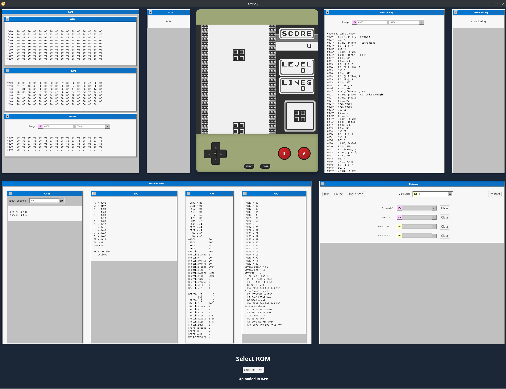

# toyboy gameboy emulator

toyboy is a gameboy emulator.

As indicated by the name, it is a toy project. 
Contrary to the name, it is written by a fully grown man.

## Architecture / goals

toyboy is written in go, and uses Wails to provide a desktop application.

It tries to be cycle-accurate, everything is triggered from the clock.

## Status

- Emulates all of Tetris correctly (except 2-player)
- On my machine, can run smoothly at about 200%

Currently looks like this



## Resources used

https://gbdev.io/resources.html

https://gekkio.fi/files/gb-docs/gbctr.pdf

https://github.com/AntonioND/giibiiadvance/blob/master/docs/TCAGBD.pdf

https://hacktix.github.io/GBEDG/ppu/

https://gbdev.io/gb-asm-tutorial/ (for ROMs)

## License

```
Copyright (C) 2025 Jonathan Reichelt Gjertsen.

This program is free software: you can redistribute it and/or modify it under the terms of the GNU General Public License as published by the Free Software Foundation, either version 2 or version 3 of the License.

This program is distributed in the hope that it will be useful,
but WITHOUT ANY WARRANTY; without even the implied warranty of
MERCHANTABILITY or FITNESS FOR A PARTICULAR PURPOSE.  See the
GNU General Public License for more details.

You should have received a copy of the GNU General Public License
along with this program.  If not, see <https://www.gnu.org/licenses/>.
```

Verbatim copies of GPL v2.0 and GPL v3.0 are provided as text files (`gpl-2.0.txt` and `gpl-3.0.txt` respectively) in this repository.

A component in this project, `blip/`, is derived from Blargg's Blip_Buffer library, which is subject to LGPL v2.1 or later. The original license text for that library is provided in the mentioned file.
